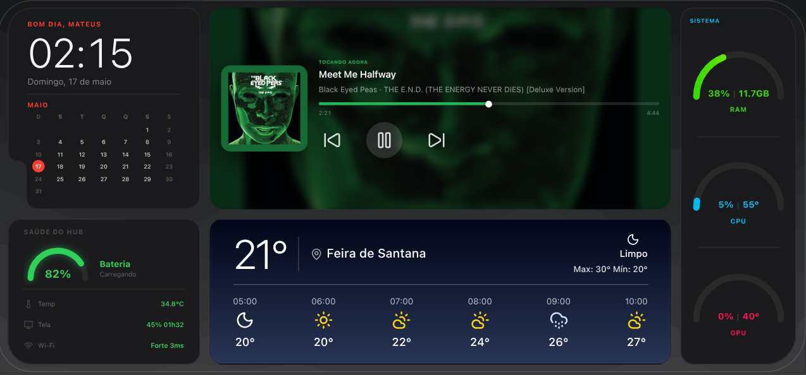
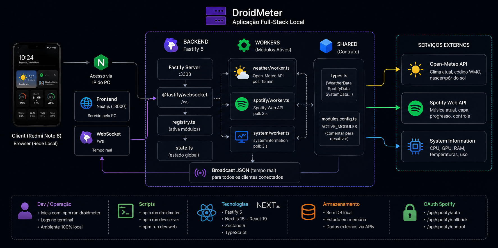

<p align="center">
  
</p>

<h1 align="center">DroidMeter</h1>

<p align="center">
  A local dashboard that turns a Redmi Note 8 into a desktop display for weather, Spotify, PC metrics, and hub health.
</p>

<p align="center">
  <a href="#pt-br"></a>
  <a href="#english"></a>
</p>

<p align="center">
  
  
  
  
  
  
</p>

---

## PT-BR

[English version](#english)

## Visão Geral

DroidMeter é uma aplicação full-stack local, feita para rodar em um PC e ser acessada por um celular na rede local. O frontend renderiza uma interface calibrada para o Redmi Note 8 em landscape, enquanto o backend coleta dados do sistema, clima e Spotify e envia atualizações em tempo real por WebSocket.

## Fluxo da Aplicação

<p align="center">
  
</p>

O Fastify concentra os workers de dados, atualiza o estado compartilhado no backend e transmite mudanças por WebSocket. O Next.js renderiza o dashboard no celular, consome o estado em tempo real via Zustand e usa API routes próprias para ações interativas do Spotify.

## Funcionalidades

- Dashboard calibrado para viewport `851 x 393` em landscape.
- Widget de clima com modos visuais para dia, noite e chuvoso/nublado.
- Widget Spotify com capa, progresso e controles play/pause/next/previous.
- Hub Health com dados reais do Redmi: bateria, temperatura, carga suspensa, tela, CPU/RAM e Wi-Fi.
- Controle automático de carga via SSH/root com thresholds de bateria e temperatura.
- Painel estilo iOS Control Center com atalhos para idle/screen saver, auto sleep, brilho, kiosk/orientação, diagnóstico e carga.
- WebSocket com hostname dinâmico para acessar pelo IP do PC no celular.
- Fonte SF Pro Text self-hosted e visual inspirado em widgets iOS.

## Stack

| Camada | Tecnologia |
| --- | --- |
| Frontend | Next.js 15, React 19, Tailwind CSS v4 |
| Backend | Fastify 5, `@fastify/websocket` |
| Estado | Zustand 5 |
| Tipos | TypeScript 5 compartilhado em `shared/` |
| Dados | Open-Meteo, Spotify Web API, `systeminformation` |

## Estrutura

```text
.
├── server/                 # Fastify, workers e WebSocket
├── web/                    # Next.js app router e componentes
├── shared/                 # Tipos e configuração de módulos
├── stuff/                  # Notas, referências e status local
├── package.json            # Workspaces e scripts raiz
└── .env.example            # Template de variáveis
```

## Como Rodar

```bash
npm install
cp .env.example .env
npm run droidmeter
```

Abra:

```text
http://localhost:3000
```

No celular, use o IP do PC na rede local:

```text
http://<ip-do-pc>:3000
```

## Variáveis de Ambiente

O backend lê `.env` na raiz. As rotas do Next também podem usar `web/.env.local` para o fluxo do Spotify.

```env
PORT=3333
WEB_ORIGIN=http://localhost:3000
NEXT_PUBLIC_WS_URL=ws://localhost:3333/ws

SPOTIFY_CLIENT_ID=
SPOTIFY_CLIENT_SECRET=
SPOTIFY_REFRESH_TOKEN=

WEATHER_LAT=-12.2664
WEATHER_LON=-38.9663

GITHUB_TOKEN=
GITHUB_USERNAME=
```

Para gerar um novo refresh token do Spotify, acesse:

```text
http://127.0.0.1:3000/api/spotify/auth
```

Use este callback no Spotify Developer Dashboard:

```text
http://127.0.0.1:3000/api/spotify/callback
```

## Scripts

```bash
npm run droidmeter    # backend + frontend em modo dev
npm run dev:server    # apenas Fastify
npm run dev:web       # apenas Next.js
npm run test          # testes dos workspaces
```

## Notas

- O layout foi ajustado para o Redmi Note 8 deitado.
- `web/.env.local`, `.env`, builds e caches são ignorados pelo Git.
- `stuff/STATUS.md` guarda o estado operacional do projeto durante a evolução da UI.

---

## English

[Versão em português](#pt-br)

## Overview

DroidMeter is a local full-stack application designed to run on a PC and be opened from a phone on the same network. The frontend renders a dashboard calibrated for a Redmi Note 8 in landscape mode, while the backend collects system, weather, and Spotify data and streams live updates through WebSocket.

## Application Flow

<p align="center">
  
</p>

Fastify owns the data workers, updates the shared backend state, and broadcasts changes over WebSocket. Next.js renders the dashboard on the phone, consumes live state through Zustand, and exposes API routes for interactive Spotify actions.

## Features

- Dashboard calibrated for a `851 x 393` landscape viewport.
- Weather widget with day, night, and cloudy/rainy visual modes.
- Spotify widget with album art, progress, and play/pause/next/previous controls.
- Hub Health with real Redmi data: battery, temperature, suspended charging, screen, CPU/RAM, and Wi-Fi.
- Automatic charging control over SSH/root with battery and temperature thresholds.
- iOS Control Center-style panel with shortcuts for idle/screen saver, auto sleep, brightness, kiosk/orientation, diagnostics, and charging.
- Dynamic WebSocket hostname so the phone can connect through the PC local IP.
- Self-hosted SF Pro Text font and iOS-widget-inspired visuals.

## Stack

| Layer | Technology |
| --- | --- |
| Frontend | Next.js 15, React 19, Tailwind CSS v4 |
| Backend | Fastify 5, `@fastify/websocket` |
| State | Zustand 5 |
| Types | TypeScript 5 shared in `shared/` |
| Data | Open-Meteo, Spotify Web API, `systeminformation` |

## Structure

```text
.
├── server/                 # Fastify, workers, and WebSocket
├── web/                    # Next.js app router and components
├── shared/                 # Shared types and module config
├── stuff/                  # Local notes, references, and status
├── package.json            # Root workspaces and scripts
└── .env.example            # Environment template
```

## Getting Started

```bash
npm install
cp .env.example .env
npm run droidmeter
```

Open:

```text
http://localhost:3000
```

On the phone, use the PC local network IP:

```text
http://<pc-ip>:3000
```

## Environment Variables

The backend reads `.env` from the project root. Next.js API routes can also use `web/.env.local` for the Spotify flow.

```env
PORT=3333
WEB_ORIGIN=http://localhost:3000
NEXT_PUBLIC_WS_URL=ws://localhost:3333/ws

SPOTIFY_CLIENT_ID=
SPOTIFY_CLIENT_SECRET=
SPOTIFY_REFRESH_TOKEN=

WEATHER_LAT=-12.2664
WEATHER_LON=-38.9663

GITHUB_TOKEN=
GITHUB_USERNAME=
```

To generate a new Spotify refresh token, open:

```text
http://127.0.0.1:3000/api/spotify/auth
```

Use this callback in the Spotify Developer Dashboard:

```text
http://127.0.0.1:3000/api/spotify/callback
```

## Scripts

```bash
npm run droidmeter    # backend + frontend in dev mode
npm run dev:server    # Fastify only
npm run dev:web       # Next.js only
npm run test          # workspace tests
```

## Notes

- The layout is tuned for a Redmi Note 8 in landscape mode.
- `web/.env.local`, `.env`, builds, and caches are ignored by Git.
- `stuff/STATUS.md` keeps the operational project context while the UI evolves.
